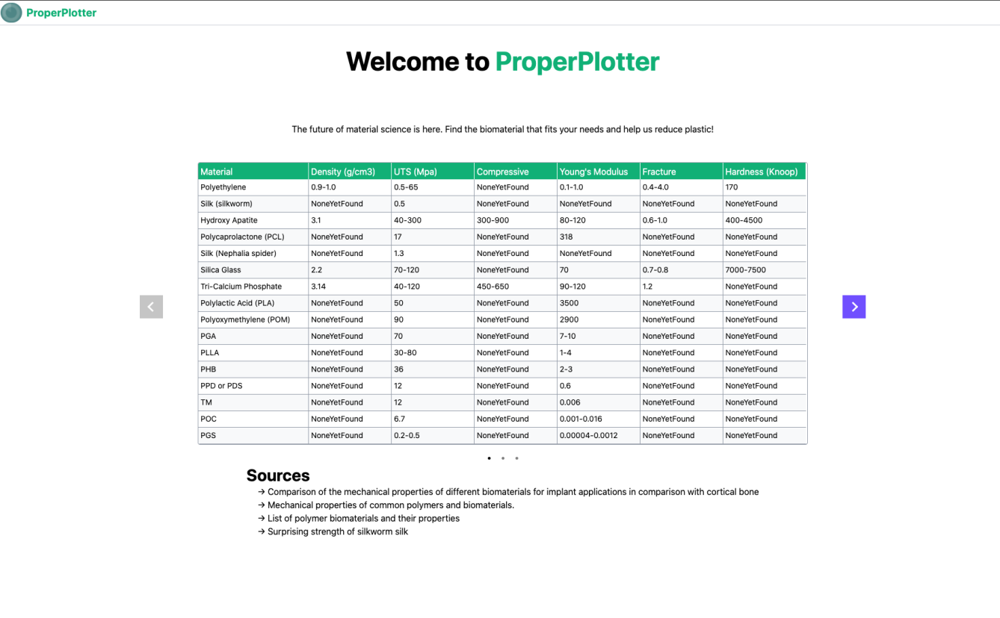

# ProperPlotter
 An interactive web app for bioplastic material properties data. We plot material properties for bioplastics properly

## Development

### Setup

We are using *poetry* as package manager (see [install instructions](https://python-poetry.org/docs/#installation) or check *setup.sh*). 
Run `poetry install` to create your python environment.

To start the app:
```python
poetry run python runserver
```

Your local django server will run on *localhost:8000*.

